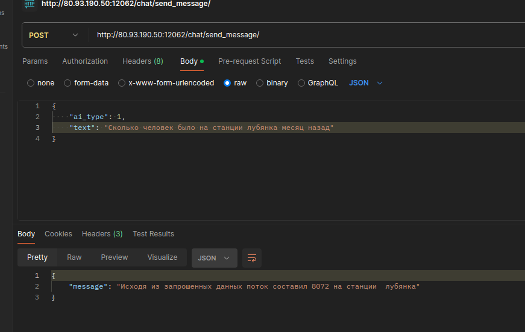

# MOSTRANS

## Бэкэнд для решение задачи определения количества пассажиров

Времени мало - поэтому кратко
Система состоит из 4 модулей
1. Бэк чата (мы тут)
2. Бэк модели [Сервис модели](https://github.com/senorUVE/mostrans_data/tree/main)
3. БД   (в контейнере на сервере, если успели, то в директории будет лежать файл ddl)
4. Фронт [фронт](https://github.com/tommanah/brigada)

На бд чата две ручки, для авторизации и для отправки сообщения в модель с фронтенда. 
Все решение развернуто на сервере по адресу:
http://80.93.190.50:12060

фронт будет на 
http://80.93.190.50:3000

p.s. если будет...

Фронт подшить не успели но он тоже есть и даже рабочий (На локалке разворачивали)

Для обращения по апи следующий curl 
```curl --location 'http://80.93.190.50:12062/chat/send_message/' \
--header 'Content-Type: application/json' \
--data '{
    "ai_type": 1,
    "text": "Сколько человек было на станции лубянка месяц назад"
}'
```


Сервер принимает запрос, перекидывает его в свой сервис с нейронкой, получает отфильтрованные данные, затем идет в бд, и получает данные, выдавая их клиенту.
Модель понимает даты - т.е. вчера, месяц назад, 2 дня назад и тд. По поводу станции бывают огрехи, потому что некоторые станции воспринимаются как прилагательные